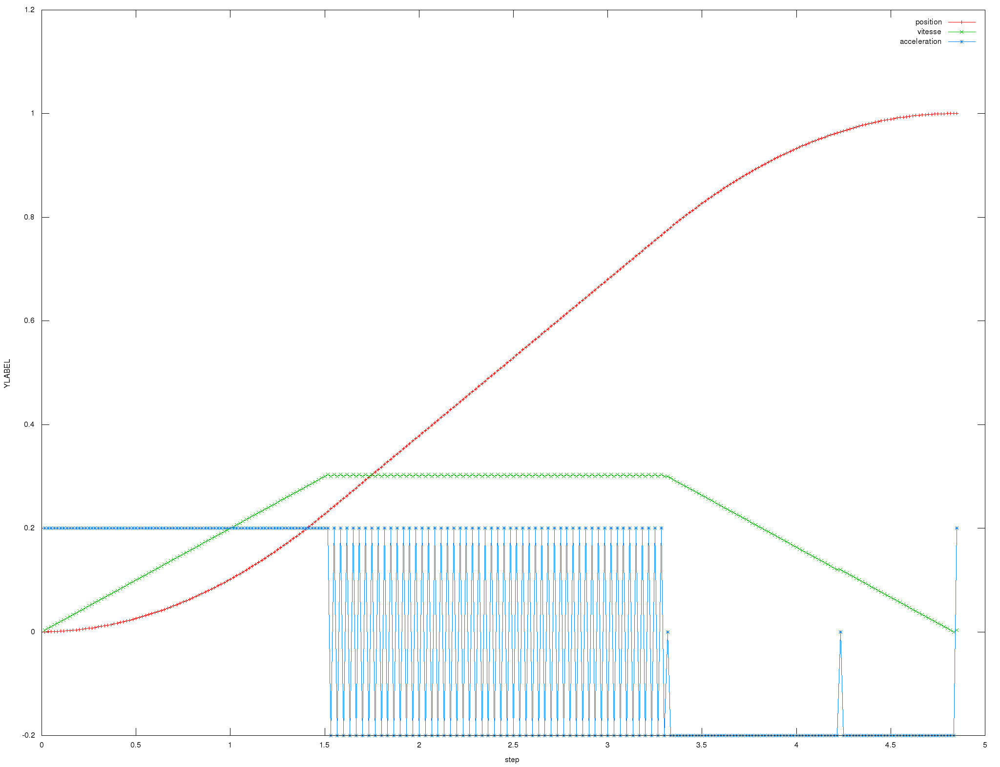

Introduction
============

Cette partie contient quelques généralités sur le fonctionnement de
l’asservissement.

Architecture
------------

La bibliothèque d’asservissement est indépendante de son implémentation sur pic
(elle est prévu pour être également utilisé dans un simulateur).

Elle est divisé en plusieurs partie, du plus bas au plus au niveau :

* `pid`: implémentation d’un régulateur pid
* `asserv`: sélection d’un pid en position, pid en vitesse ou arrêt (roue libre)
* `motion`: gestion des fonctions de déplacement, utilise derrière deux asserv :
  une en delta et l’autre en alpha.

L’utilisateur n’accède qu’aux fonctions fournises par le module `motion`. C’est
le module `motion` qui derrière instancie deux `asserv` elles même instanciant
deux `pid` chacune.

À cela s’ajoute des fonctions de générations de rampe, utilisé par motion, et un
module d’odométrie calculant la position absolue du robot.

Fonctionnement général
----------------------

L’asservissement fonctionne de manière discrète, à une fréquence de l’ordre de
100Hz à 1000Hz (10ms à 1ms entre chaque `step`). La valeur optimal est toujours
en débat, une durée plus faible est théoriquement plus précise mais implique
également plus de calculs, avec les erreurs d’arrondi associé (notamment lors
des calculs trigonométrique).

À chaque `step`, l’asservissement prend en entrée les `tics` des roues gauche et
droite depuis la dernière itération et ressort les nouvelles consignes pour
chaques roues. Derrière cela se cache pas mal de calcul !

Odométrie
---------

Les `tics` du `step` courant sont d’abord envoyé à l’odométrie, qui met à jour
les coordonnées du robot. On pourra par exemple consulter cette page de
`clubelek` (INSA Lyon) pour plus d’informations :
http://clubelek.insa-lyon.fr/joomla/fr/base_de_connaissances/informatique/calcul_d_odometrie_approximation_tra.php.

Asservissement polaire
----------------------

Le robot se commande par une consigne sur la roue droite et une consigne sur la
roue gauche, et non directement par une consigne de position absolue.
Ainsi, si l’on souhaite avancer d’un mètre dans une direction fixe, on souhaite
*à priori* que chaques roues parcours un mètre.
Cependant, ceci a un petit inconvéniant : si une roue se voit retardé par
rapport à l’autre roue, le robot va dévier de sa trajectoire.

C’est pourquoi l’on préfère effectuer un asservissement polaire : on ne
considère plus des consignes roue droite / roue gauche, mais des consignes
delta (somme roue droite / roue gauche) / alpha (différence roue droite / roue
gauche).
À cela s’ajoute quelques coefficiants afin de tenir compte des encodeurs, de la
taille des roues et de l’entraxe du robot.
Le calcul d’alpha nécessite théoriquement un sinus, mais on considère être dans
une situation de petite angle.

.. math::

    \delta = \frac{\mathrm{ticsDroit} + \mathrm{ticsGauche}}{2}
                \cdot \mathrm{meterByTic}

    \alpha = \frac{\mathrm{ticsDroit} - \mathrm{ticsGauche}}{\mathrm{entraxe}}
                \cdot \mathrm{meterByTic}

L’asservissement est alors fait sur ses deux grandeurs, et la transformation
inverse est effectué pour transmettre les consignes aux moteurs.

Ces deux variables contiennent des valeurs dérivées : il s’agit seulement de la
variation par rapport au dernier `step`. Nous appellerons respectivement `dist`
et `theta` leur valeur absolue, c’est à dire leur intégration au cours du temps
(ainsi, à chaque `step, `dist` se voit aditionner la dernière valeur de `delta`
et `theta` se voit aditionner la dernière valeur d'`alpha`).

Génération des consignes
------------------------

Nous avons à présent une variable `dist` et une variable `theta`.
Pour effectuer notre déplacement d’un mètre linéaire, il suffit de se fixer un
objectif d’un mètre pour la variable `dist` et de maintenir nulle la valeur de
`theta`.

La variable theta peut être directement asservie par un PID : celui-ci
s’occupera de corriger les erreurs dès que le robot s’écarte de la direction
voulu.
En revanche, il n’est pas possible d’utiliser directement un PID sur la distance
final que doit parcourir le robot. En effet, la réponse d’un PID est peut
souhaiter : accélération lente, dépassement, oscillation, pas de contrôle de
l’accélération ou de la vitesse …

Comme nous sommes exigeant nous voulons un déplacement « parfait » du robot :
une première phase d’accélération, avec une accélération constante déterminé par
l’adhérence des roues sur le sol, une phase constante à la vitesse maximal
possible pour le robot sans perdre ses boulons, et une phase de décélération tel
que le robot ait une vitesse nulle en atteignant son objectif.

Pour cela, à chaque `step`, nous calculons la position que devrait avoir le
robot pour suivre ce profil idéal. Cette position sert alors d’objectif à un
régulateur PID. Bien évidemment, la consigne de ce régulateur PID se voit
modifié à chaque `step`. Cependant, la consigne évolue faiblement à chaque
`step`, et le PID n’a donc qu’une faible correction a effectuer.

Ce principe de génération de consigne de position est également utilisé pour les
consignes de vitesse. En effet, là encore un simple PID aurait un comportement
peu envié : accélération non contrôlé, oscillation autour de la vitesse final …
De la mème manière, nous calculons à chaque `step` la position souhaité pour que
le robot suive un profil d’accélération contrôlé et respecte la consigne de
vitesse. L’asservissement se fait encore en position par un PID.

Voici un exemple de rampe généré.
Les paramètres utilisé sont une distance d’un mètre, des vitesses initiale et
finale nulles, une accélération de 0.2 mètres par seconde et une vitesse maximal
de 0.3 mètre par seconde. On remarque de nombreuse fluctuation de l’accélération
dû aux méthodes interne de calcul de celle-ci (cf :doc:`Rampe de distance <ramp_dist>`) mais cela n’a que très
peu d’influence sur les consignes de positions et ne gène en rien la régulation.
