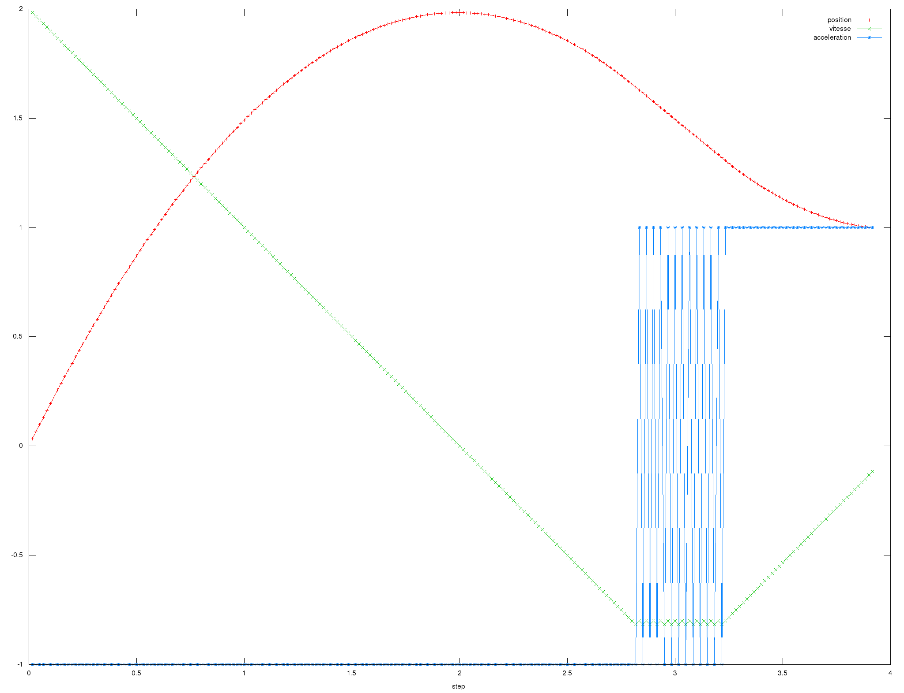

Rampe de distance
=================

Le fichier `ramp_dist.c` contient un générateur de rampe pour atteindre une
consigne de distance.

Cette fonction prend en argument la distance à parcourir, l’état actuel
(position, vitesse), la vitesse souhaitée lorsque la distance aura été parcourue,
ainsi que les accélération et vitesse maximales tolérées.

La fonction de génération de rampe est totalement stateless : elle ignore si
elle est dans une phase d’accélération, de décélération ou dans une phase
constante. Elle se contente de prendre en argument la vitesse actuelle et de
déterminer, compte tenu de la distance à parcourir et la vitesse finale
désirée, s’il est possible d’accélérer ou au contraire s’il faut ralentir.

Cette approche permet de modifier la consigne finale à tout moment, lors du
prochain `step` l’action la plus judicieuse est alors effectuée (accélération ou
décélération).

Ceci a pour effet de bord de faire apparaître des oscillations sur
l’accélération lors des phases de vitesse constante.
L’asservissement se faisant sur les consignes de position, cela est bien lissé
et sans conséquence.


Traçé de profil avec gnuplot
----------------------------

Le script `plot-dist.sh` permet de tracer des rampes avec gnuplot en utilisant
le petit utilitaire `test_ramp_dist`.
Les graphes générés peuvent être récupérés dans `/tmp`.


Exemples
--------

Voici quelques exemples commentés de rampes pouvant être générées.

Exemple 1
`````````

* Distance : 1 m
* Vitesse initiale : 0 m.s⁻¹
* Vitesse finale : 0 m.s⁻¹
* Vitesse max : 1 m.s⁻¹
* Accélération max : 1 m.s⁻²


Courbe classique avec une phase d’accélération, une phase « constante »
(artefact dû au fait qu’on ne roule jamais à la bonne vitesse mathématiquement
parlant) et une phase de décélération. La consigne est bien atteinte.

Exemple 2
`````````

* Distance : 1m
* Vitesse initiale : 0 m.s⁻¹
* Vitesse finale : 1 m.s⁻¹
* Vitesse max : 1 m.s⁻¹
* Accélération max : 1 m.s⁻²

.. image:: img/ramp_dist_speed_end.png
    :width: 800px
    :align: center

Cette fois-ci, la vitesse finale n’est pas nulle. La consigne est bien atteinte.

Exemple 3
`````````

* Distance : 1 m
* Vitesse initiale : 0 m.s⁻¹
* Vitesse finale : 0.5 m.s⁻¹
* Vitesse max : 1 m.s⁻¹
* Accélération max : 1 m.s⁻²


Même graphique que l’exemple 2, mais la vitesse finale est inférieure à la vitesse
maximale faisant alors apparaître un petit palier constant.
La consigne est bien atteinte.

Exemple 4
`````````

* Distance : 0.5 m
* Vitesse initial : 0 m.s⁻¹
* Vitesse finale : 1 m.s⁻¹
* Vitesse max : 1 m.s⁻¹
* Accélération max : 1 m.s⁻²

.. image:: img/ramp_dist_too_slow.png
    :width: 800px
    :align: center

La position voulue est bien atteinte, mais la vitesse désirée est trop faible
malgré une accélération maximale constante. Tans pis !

Exemple 5
`````````

* Distance : 1 m
* Vitesse initiale : 2 m.s⁻¹
* Vitesse finale : 0 m.s⁻¹
* Vitesse max : 0.8 m.s⁻¹
* Accélération max : 1 m.s⁻²



Ici, la consigne de distance est rapidement atteinte, mais la consigne de
vitesse ne l’est pas ! En effet, la vitesse initiale de 2 m.s⁻¹ est trop
importante pour pouvoir s’arrêter en 1 mètre .

Cependant, en prolongeant la rampe, on constate que les deux consignes (distance
et vitesse) sont bien atteintes (en marche arrière !).

Exemple 6
`````````

* Distance : 1 m
* Vitesse initial : -1 m.s⁻¹
* Vitesse finale : 1 m.s⁻¹
* Vitesse max : 1 m.s⁻¹
* Accélération max : 1 m.s⁻²


La vitesse initiale est négative, mais cela n’empêche pas de respecter les
consignes de distance et de vitesse.
